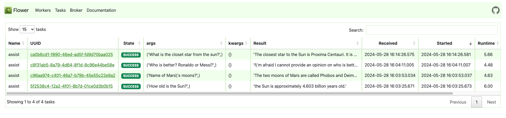

# Astro GPT

## Description

Astro GPT is an innovative project designed to provide a seamless experience for natural language processing tasks for astronomy topic. Its main features include robust API integration and efficient task monitoring.

## Run

To utilize this project, ensure Docker is installed on your local machine and follow these steps:

-   **Step 1:** Clone this repository to your local machine.
-   **Step 2:** Navigate to the project directory.
-   **Step 3:** Create a `.env` file in the root directory and define the necessary environment variables as outlined below.
-   **Step 4:** Run:

```
docker-compose up
```

-   **Step 5:** Access `http://0.0.0.0:8888/docs` for testing the API and `http://0.0.0.0:5555/` for task monitoring.

## Environment Variables

Below is an example of the required `.env` file:

```
OPENAI_API_KEY=<YOUR_OPENAI_API_KEY>
CLAUDE_API_KEY=<YOUR_CLAUDE_API_KEY>
SEARCH_ENGINE_API_KEY=<YOUR_GOOGLE_PROGRAMABLE_SEARCH_ENGINE_API_KEY>
SEARCH_ENGINE_ID=<YOUR_GOOGLE_PROGRAMABLE_SEARCH_ENGINE_ID>

REDIS_URL=redis://redis:6379

CELERY_BROKER_URL=redis://redis:6379
CELERY_RESULT_BACKEND=redis://redis:6379
```

-   `OPENAI_API_KEY`: Check out this link for more details.
-   `CLAUDE_API_KEY`: Check out this link for more details.
-   `SEARCH_ENGINE_API_KEY` and `SEARCH_ENGINE_API_KEY`: Check out this link for more details.

## API Documentation

### Endpoint: `/ask`

-   **Description:** This endpoint allows users to submit queries for information retrieval.
-   **Method:** GET
-   **Parameters:**
    -   `query` (required): The query string for information retrieval.
-   **Example Request:**

```
curl -X 'GET' \
  'http://0.0.0.0:8888/ask?query=What%20is%20the%20closest%20star%20from%20the%20sun%3F' \
  -H 'accept: application/json'
```

-   **Example Response:**

```json
{
    "request_id": "5a21b70a-df0a-4dbb-86d6-8fce07edcf82",
    "user": "What is the closet star from the sun?",
    "assistant": "The closest star to our Sun is the three-star system called Alpha Centauri. It is located roughly 4.37 light-years away from Earth in the southern constellation of Centaurus. \n\nAlpha Centauri consists of three stars: Alpha Centauri A, Alpha Centauri B and Alpha Centauri C.\n\nAlpha Centauri A is the principal member of the triple star system and is a solar-like main sequence star similar in size to the Sun. \n\nAlpha Centauri B is slightly smaller and cooler than the principal member.  \n\nAlpha Centauri C, also known as Proxima Centauri, is the closest star to our Sun at a distance of about 4.24 light-years. It is a small, low-mass red dwarf star.\n\nSo in summary, the closest star system to our Sun is the three-star Alpha Centauri system, and in that system, the nearest individual star is Alpha Centauri C or Proxima Centauri at around 4.24 light-years away."
}
```

-   **Response Codes:**
    -   `200 OK`: Successful request.
    -   `400 Bad Request`: Invalid request parameters.
    -   `500 Internal Server Error`: Server error occurred.

## Demo

For a very simple demonstration, visit `http://localhost:8501/`


## Screenshots

Swagger API:


Flower for monitoring:

